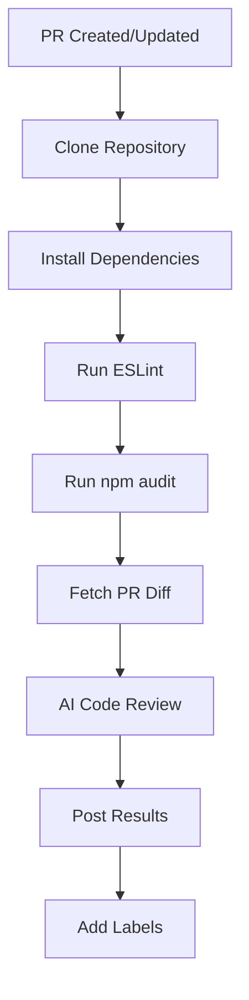
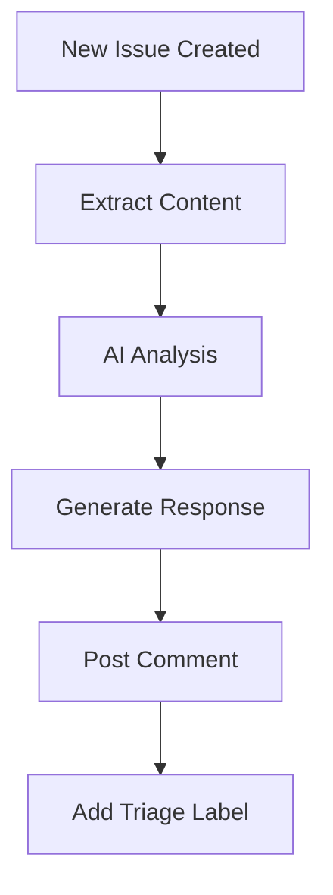
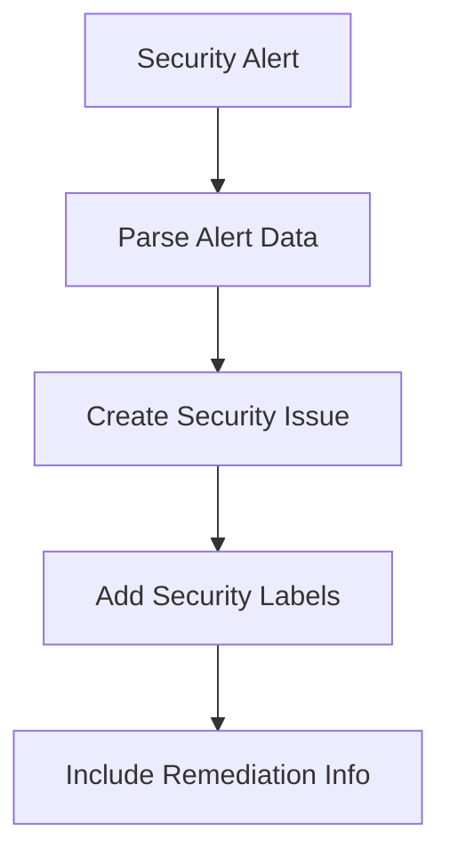

# PR Sentinel 🤖 - Intelligent Repository Assistant Manager

> **The Ultimate GitHub Webhook Bot for Automated Repository Management**

PR Sentinel is a production-ready GitHub webhook bot that transforms repository management through AI-powered automation, comprehensive code quality checks, and intelligent security monitoring.

## 🚀 **Why PR Sentinel is the Best Repository Assistant**

### ✅ **Complete Feature Set**
- **AI-Powered Code Reviews** using Google's Gemini AI
- **Automated Quality Gates** with ESLint and npm audit
- **Intelligent Issue Triage** with AI-generated responses
- **Real-Time Security Monitoring** for all GitHub security alerts
- **Smart Labeling System** for automated organization

### ✅ **Production-Ready Architecture**
- **Robust Error Handling** with graceful failure recovery
- **Comprehensive Logging** for monitoring and debugging
- **Security-First Design** with webhook signature verification
- **Modular Codebase** for easy maintenance and extension
- **Timeout Protection** to prevent resource exhaustion

### ✅ **Zero Configuration Required**
- **Environment Validation** ensures proper setup
- **Automatic Fallbacks** for API failures
- **User-Friendly Error Messages** for better UX
- **Health Check Endpoint** for monitoring

## 🏗️ **Architecture Overview**

```
┌─────────────────┐    ┌─────────────────┐    ┌─────────────────┐
│   GitHub Webhook │───▶│  PR Sentinel Bot │───▶│  Gemini AI API  │
│                 │    │                 │    │                 │
│ • Pull Requests │    │ • Event Router  │    │ • Code Reviews  │
│ • Issues        │    │ • Error Handler │    │ • Issue Replies │
│ • Discussions   │    │ • Logger        │    │ • Security      │
│ • Security Alerts│   │ • Validator     │    │   Analysis      │
└─────────────────┘    └─────────────────┘    └─────────────────┘
                                │
                                ▼
                       ┌─────────────────┐
                       │  GitHub API     │
                       │                 │
                       │ • Create Issues │
                       │ • Post Comments │
                       │ • Add Labels    │
                       │ • Update PRs    │
                       └─────────────────┘
```

## 📋 **Core Features**

### 🤖 **AI-Powered Intelligence**
- **Smart Code Reviews**: Analyzes PR diffs for style, security, and quality issues
- **Intelligent Issue Responses**: Generates helpful, contextual replies to new issues
- **Context-Aware Analysis**: Understands code context and provides actionable feedback
- **Multi-Language Support**: Works with any programming language through AI analysis

### 🔍 **Automated Quality Checks**
- **ESLint Integration**: Runs comprehensive linting on JavaScript/TypeScript code
- **Security Audits**: Performs npm audit for dependency vulnerabilities
- **Quality Gates**: Ensures code meets quality standards before merging
- **Timeout Protection**: Prevents hanging operations with configurable timeouts

### 🚨 **Security Monitoring**
- **Code Scanning Alerts**: Monitors for security vulnerabilities in code
- **Secret Scanning**: Detects exposed secrets and credentials
- **Dependabot Alerts**: Tracks dependency security issues
- **Automated Issue Creation**: Creates detailed security issues with remediation guidance

### 📝 **Smart Automation**
- **Automatic Labeling**: Adds appropriate labels (needs-review, triage, security)
- **Issue Triage**: Automatically categorizes and responds to new issues
- **PR Management**: Streamlines pull request review process
- **Discussion Support**: Provides AI assistance for repository discussions

## 🛠️ **Technical Stack**

| Component | Technology | Purpose |
|-----------|------------|---------|
| **Web Framework** | FastAPI | High-performance async web server |
| **GitHub Integration** | PyGithub | GitHub API client |
| **AI Engine** | Google Gemini | Intelligent code analysis and responses |
| **Code Quality** | ESLint + npm | Automated code quality checks |
| **Security** | HMAC-SHA256 | Webhook signature verification |
| **Monitoring** | Structured Logging | Comprehensive error tracking |

## 🚀 **Quick Start**

### 1. **Installation**

```bash
# Clone the repository
git clone <your-repo-url>
cd pr_sentinal

# Install dependencies
pip install -r requirements.txt
```

### 2. **Environment Setup**

Create a `.env` file:

```env
# Required: GitHub Personal Access Token
GITHUB_TOKEN=ghp_your_token_here

# Required: Webhook secret for signature verification
WEBHOOK_SECRET=your_webhook_secret_here

# Required: Google Gemini API key
GEMINI_API_KEY=your_gemini_api_key_here
```

### 3. **GitHub Webhook Configuration**

1. Go to your repository → Settings → Webhooks
2. Add webhook with URL: `https://your-domain.com/webhook`
3. Select events:
   - ✅ Pull requests
   - ✅ Issues
   - ✅ Discussions
   - ✅ Code scanning alerts
   - ✅ Secret scanning alerts
   - ✅ Dependabot alerts
4. Set content type: `application/json`
5. Add your webhook secret

### 4. **Run the Bot**

```bash
# Development
uvicorn app.main:app --reload --host 0.0.0.0 --port 8000

# Production
uvicorn app.main:app --host 0.0.0.0 --port 8000
```

## 📊 **Complete Workflow**

### 🔄 **Pull Request Processing**



**What happens:**
1. **Repository Cloning**: Safely clones the PR branch to temporary directory
2. **Dependency Installation**: Installs npm dependencies with timeout protection
3. **Quality Checks**: Runs ESLint for code quality and npm audit for security
4. **AI Analysis**: Sends PR diff to Gemini AI for comprehensive review
5. **Result Posting**: Creates detailed comment with all findings
6. **Smart Labeling**: Adds "needs-review" label for follow-up

### 🎯 **Issue Triage**



**What happens:**
1. **Content Extraction**: Combines issue title and body for analysis
2. **AI Processing**: Sends content to Gemini AI for intelligent response generation
3. **Helpful Response**: Posts contextual, helpful reply to the issue
4. **Automated Triage**: Adds "triage" label for team follow-up

### 🚨 **Security Alert Handling**



**What happens:**
1. **Alert Processing**: Parses GitHub security alert data
2. **Issue Creation**: Creates detailed security issue with all relevant information
3. **Smart Labeling**: Adds "security" label for proper categorization
4. **Remediation Guidance**: Includes actionable remediation steps

## 🔧 **Configuration**

### Environment Variables

| Variable | Required | Description | Example |
|----------|----------|-------------|---------|
| `GITHUB_TOKEN` | ✅ | GitHub Personal Access Token | `ghp_abc123...` |
| `WEBHOOK_SECRET` | ✅ | Webhook signature secret | `my_secret_key` |
| `GEMINI_API_KEY` | ✅ | Google Gemini API key | `AIzaSy...` |

### API Endpoints

| Endpoint | Method | Description |
|----------|--------|-------------|
| `/health` | GET | Health check endpoint |
| `/webhook` | POST | GitHub webhook receiver |

## 🛡️ **Security Features**

### Webhook Security
- **Signature Verification**: Validates GitHub webhook signatures using HMAC-SHA256
- **Input Validation**: Sanitizes all incoming webhook data
- **Error Sanitization**: Prevents information leakage in error messages

### API Security
- **Timeout Protection**: Prevents resource exhaustion with configurable timeouts
- **Error Handling**: Graceful handling of API failures
- **Rate Limiting**: Built-in protection against API abuse

### Environment Security
- **Variable Validation**: Ensures all required environment variables are present
- **Secure Logging**: Logs sensitive information safely
- **Fallback Responses**: Provides helpful error messages without exposing internals

## 📈 **Monitoring & Logging**

### Health Monitoring
```bash
# Check bot health
curl https://your-domain.com/health
# Response: {"status": "healthy", "service": "PR Sentinel"}
```

### Logging Levels
- **INFO**: Normal operations (webhook processing, API calls)
- **WARNING**: Non-critical issues (missing headers, API timeouts)
- **ERROR**: Critical issues (authentication failures, processing errors)

### Key Metrics
- Webhook processing time
- API call success rates
- Error frequency and types
- AI response quality

## 🚀 **Deployment Options**

### Docker Deployment
```dockerfile
FROM python:3.11-slim

WORKDIR /app
COPY requirements.txt .
RUN pip install -r requirements.txt

COPY . .
CMD ["uvicorn", "app.main:app", "--host", "0.0.0.0", "--port", "8000"]
```

### Cloud Deployment
- **Heroku**: Easy deployment with environment variables
- **AWS Lambda**: Serverless deployment with API Gateway
- **Google Cloud Run**: Containerized deployment
- **DigitalOcean App Platform**: Managed container deployment

## 🔍 **Troubleshooting**

### Common Issues

**Webhook Not Receiving Events**
```bash
# Check webhook configuration
curl -X POST https://your-domain.com/webhook \
  -H "Content-Type: application/json" \
  -H "X-GitHub-Event: ping" \
  -d '{"zen":"Hello World"}'
```

**AI Reviews Not Working**
- Verify `GEMINI_API_KEY` is set correctly
- Check Gemini API quota and billing
- Review logs for API error messages

**Code Quality Checks Failing**
- Ensure Node.js is installed on the server
- Verify repository has `package.json`
- Check network connectivity for npm install

### Debug Mode
```bash
# Enable debug logging
export LOG_LEVEL=DEBUG
uvicorn app.main:app --reload
```

## 🤝 **Contributing**

We welcome contributions! Here's how to get started:

1. **Fork the repository**
2. **Create a feature branch**: `git checkout -b feature/amazing-feature`
3. **Make your changes** and add tests
4. **Commit your changes**: `git commit -m 'Add amazing feature'`
5. **Push to the branch**: `git push origin feature/amazing-feature`
6. **Open a Pull Request**

### Development Setup
```bash
# Install development dependencies
pip install -r requirements.txt

# Run tests (when available)
python -m pytest

# Run linting
flake8 app/
```

## 📄 **License**

This project is licensed under the MIT License - see the [LICENSE](LICENSE) file for details.

## 🆘 **Support**

### Getting Help
- **Documentation**: This README contains comprehensive setup and usage information
- **Issues**: Create an issue for bugs or feature requests
- **Discussions**: Use GitHub Discussions for questions and ideas

### Community
- **GitHub Issues**: Report bugs and request features
- **GitHub Discussions**: Ask questions and share ideas
- **Contributions**: Submit pull requests for improvements

---

## 🏆 **Why PR Sentinel is the Best**

✅ **Complete Automation**: Handles PRs, issues, discussions, and security alerts  
✅ **AI-Powered Intelligence**: Uses cutting-edge Gemini AI for smart analysis  
✅ **Production-Ready**: Robust error handling, logging, and monitoring  
✅ **Security-First**: Comprehensive security features and validation  
✅ **Zero Maintenance**: Self-healing with automatic error recovery  
✅ **Scalable Architecture**: Modular design for easy extension  
✅ **User-Friendly**: Clear documentation and helpful error messages  

**PR Sentinel** - The intelligent repository assistant that makes your development workflow smarter, safer, and more efficient! 🚀

---

*Built with ❤️ using FastAPI, PyGithub, and Google Gemini AI*
